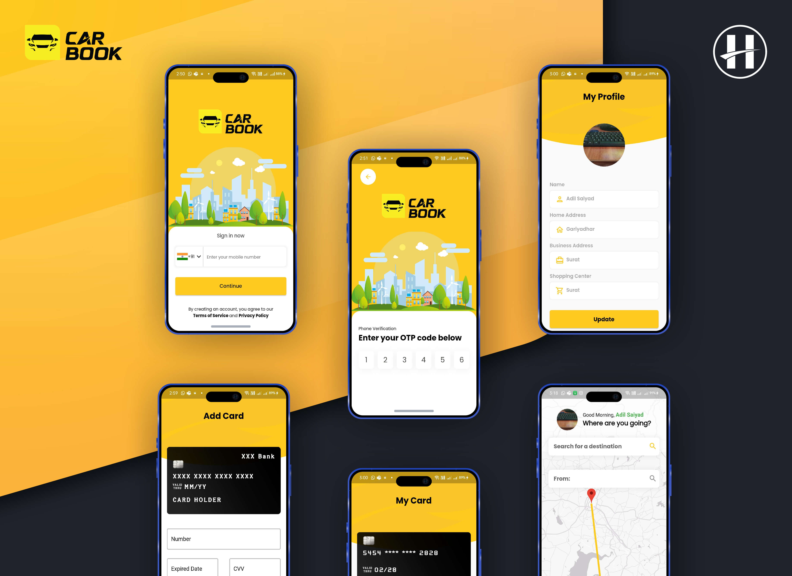

#Car Book App

#Car Book App is mobile application develop using Flutter with Firebase Database, Firebase Auth,Firebase Storage.

**Features**:

- Material mobile UI/UX design.
- Driver/User Login.
- Login with firebase auth(OTP).
- Store user profile in firebase database.
- Set-up user/driver profile screen.
- Show Google map with custom polyline and show custom marker pin on map.
- Add payment cards.
- car registration process screens.

**Notes**:

1) Please add your Google-service.json file into android/app/ and also Google-service-info.plist file into ios/Runner/

2) Also add your Google map API key in AndroidMainfiest File and in app_constants.dart

https://github.com/HypeTeqSoftware/CarBookApp/assets/106724238/4c4635e0-daba-48c3-840b-2b85f1c048b5

